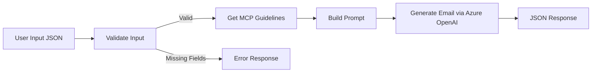

# Email Generator Agent

An AI-powered professional email generator built with **LangGraph**, **Azure OpenAI**, and **MCP (Model Context Protocol)**, deployed as an **Azure AI Foundry Hosted Agent**.

## Architecture



**Components:**

- **LangGraph** — Orchestrates the email generation workflow as a stateful graph
- **Azure OpenAI** — Generates the email using GPT with structured output
- **MCP Server** — Provides tone-specific writing guidelines via FastMCP
- **Azure AI Foundry** — Hosts the agent with the Invocations protocol

## Project Structure

```
├── src/email_generator/
│   ├── graph.py           # LangGraph workflow definition
│   ├── hosted_agent.py    # Azure Foundry host server
│   ├── llm.py             # Azure OpenAI client setup
│   ├── prompts.py         # Email generation prompt template
│   ├── state.py           # State and output schemas
│   └── mcp_client.py      # MCP client configuration
├── mcp_server/
│   ├── server.py           # FastMCP server with tone guidelines
│   └── http_server.py      # HTTP transport for deployed MCP
├── tests/
│   ├── test_deployed_agent.py  # Integration tests for deployed agent
│   ├── test_mcp.py             # MCP server tests
│   └── test_mcp_http.py        # MCP HTTP transport tests
├── infra/                  # Azure Bicep infrastructure
├── azure.yaml              # Azure Developer CLI configuration
└── start_agent.py          # Local development entry point
```

## Input / Output

**Request:**

```json
{
  "tone": "formal",
  "context": "Inform the client that the project deployment has been completed.",
  "data_points": [
    "Deployment completed on August 25, 2026",
    "All planned features were deployed",
    "Initial validation testing passed",
    "No critical issues were found"
  ]
}
```

**Response:**

```json
{
  "response": "{\"subject\": \"Project Deployment Completed Successfully\", \"email\": \"Dear Client,\\n\\nWe are pleased to inform you that...\"}"
}
```

### Supported Tones

`formal` · `friendly` · `empathetic` · `assertive`

## Prerequisites

- Python 3.14+
- [Azure CLI](https://learn.microsoft.com/cli/azure/install-azure-cli) & [Azure Developer CLI (`azd`)](https://learn.microsoft.com/azure/developer/azure-developer-cli/install-azd)
- Azure OpenAI resource with a deployed model
- Azure AI Foundry project

## Setup

```bash
# Clone the repository
git clone https://github.com/KRUNALSINH-MRI/Email-Generator-Agent.git
cd Email-Generator-Agent

# Create virtual environment
uv venv && source .venv/bin/activate
uv sync

# Configure environment variables
cp .env.example .env
# Set AZURE_OPENAI_ENDPOINT and AZURE_AI_MODEL_DEPLOYMENT_NAME
```

## Run Locally

```bash
# Start the agent server
python start_agent.py

# Test with curl
curl -s -X POST http://localhost:8088/invocations \
  -H "Content-Type: application/json" \
  -d '{"tone": "formal", "context": "Project deployment completed.", "data_points": ["All features deployed", "Testing passed"]}'
```

## Deploy to Azure

```bash
az login
azd up        # Provision + deploy
azd deploy    # Deploy only (after initial setup)
```

## Run Tests

```bash
pytest tests/test_deployed_agent.py -v
```