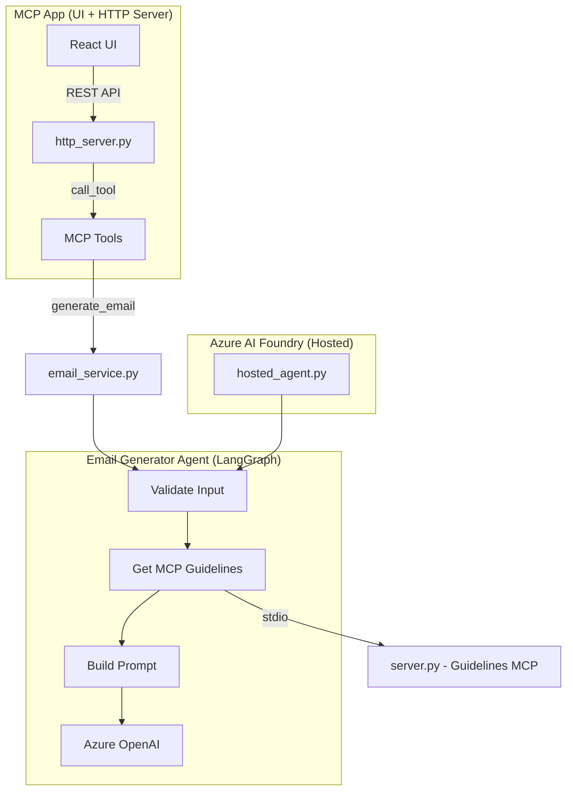

# Email Generator Agent

An AI-powered professional email generator built with **LangGraph**, **Azure OpenAI**, and **MCP (Model Context Protocol)**. Features a React-based MCP App UI for interactive email generation, review, and approval — plus a headless hosted agent deployable to **Azure AI Foundry**.

## Architecture



**Components:**

- **LangGraph** — Orchestrates the email generation workflow as a stateful graph
- **Azure OpenAI** — Generates the email using GPT with structured output
- **MCP Server** (`server.py`) — Provides tone-specific writing guidelines via FastMCP (stdio transport)
- **MCP App** (`http_server.py`) — Full HTTP server with MCP tools, REST API bridge, and React UI
- **Azure AI Foundry** — Hosts the agent with the Invocations protocol

## Project Structure

```
├── src/email_generator/
│   ├── graph.py            # LangGraph workflow definition
│   ├── hosted_agent.py     # Azure Foundry host server
│   ├── llm.py              # Azure OpenAI client setup
│   ├── prompts.py          # Email generation prompt template
│   ├── state.py            # State and output schemas
│   ├── mcp_client.py       # MCP client (stdio or remote)
│   └── main.py             # CLI entry point
├── mcp_server/
│   ├── server.py           # FastMCP guidelines server (stdio)
│   ├── http_server.py      # MCP App: HTTP server + REST bridge + UI
│   ├── email_service.py    # Agent invocation wrapper
│   └── ui/                 # React + TypeScript MCP App UI
│       ├── src/
│       │   ├── App.tsx     # Main app component
│       │   └── main.tsx    # Entry point
│       ├── package.json
│       └── vite.config.ts
├── tests/
│   ├── test_agent.py           # Agent unit tests
│   ├── test_deployed_agent.py  # Integration tests for deployed agent
│   ├── test_mcp.py             # MCP server tests
│   └── test_mcp_http.py        # MCP HTTP transport tests
├── infra/                  # Azure Bicep infrastructure
├── azure.yaml              # Azure Developer CLI configuration
├── Dockerfile              # Container image for MCP App
├── start_agent.py          # Local hosted agent entry point
└── pyproject.toml          # Python project configuration
```

## MCP Tools

| Tool | Description |
|------|-------------|
| `get_email_guidelines` | Returns tone-specific professional writing guidelines |
| `generate_email` | Generates a professional email using the LangGraph agent |
| `approve_email` | Approves and sends the generated email |
| `reject_email` | Rejects the generated email |

## Input / Output

**Request:**

```json
{
  "tone": "formal",
  "context": "Inform the client that the project deployment has been completed.",
  "data_points": [
    "Deployment completed on August 25, 2026",
    "All planned features were deployed",
    "Initial validation testing passed",
    "No critical issues were found"
  ]
}
```

**Response:**

```json
{
  "subject": "Project Deployment Completed Successfully",
  "email": "Dear Client,\n\nWe are pleased to inform you that..."
}
```

### Supported Tones

`formal` · `friendly` · `empathetic` · `assertive`

## Prerequisites

- Python 3.14+
- Node.js 18+ (for UI development)
- [Azure CLI](https://learn.microsoft.com/cli/azure/install-azure-cli) & [Azure Developer CLI (`azd`)](https://learn.microsoft.com/azure/developer/azure-developer-cli/install-azd)
- Azure OpenAI resource with a deployed model
- Azure AI Foundry project

## Setup

```bash
# Clone the repository
git clone https://github.com/KRUNALSINH-MRI/Email-Generator-Agent.git
cd Email-Generator-Agent

# Create virtual environment
uv venv && source .venv/bin/activate
uv sync

# Install UI dependencies
cd mcp_server/ui && npm install && cd ../..

# Configure environment variables
cp .env.example .env
# Set AZURE_OPENAI_ENDPOINT and AZURE_AI_MODEL_DEPLOYMENT_NAME
```

## Run Locally

### MCP App (UI + HTTP Server)

```bash
# Build the React UI
cd mcp_server/ui && npm run build && cd ../..

# Start the MCP App server
PYTHONPATH=src python -m mcp_server.http_server
```

Open http://localhost:8000 to use the Email Generator UI.

### Hosted Agent (Headless)

```bash
# Start the Azure AI Foundry-compatible agent server
python start_agent.py

# Test with curl
curl -s -X POST http://localhost:8088/invocations \
  -H "Content-Type: application/json" \
  -d '{"tone": "formal", "context": "Project deployment completed.", "data_points": ["All features deployed", "Testing passed"]}'
```

### UI Development (Hot Reload)

```bash
# Terminal 1: Start the backend
PYTHONPATH=src python -m mcp_server.http_server

# Terminal 2: Start the Vite dev server
cd mcp_server/ui && npm run dev
```

Open http://localhost:5173 for the dev server with hot module replacement.

### MCP Inspector

```bash
# Test MCP tools interactively
PYTHONPATH=. fastmcp dev apps mcp_server/http_server.py
```

## Deploy to Azure

### Using Azure Developer CLI

```bash
az login
azd up        # Provision + deploy
azd deploy    # Deploy only (after initial setup)
```

### Using Docker

```bash
docker build -t email-generator .
docker run -p 8000:8000 \
  -e AZURE_OPENAI_ENDPOINT=<your-endpoint> \
  -e AZURE_AI_MODEL_DEPLOYMENT_NAME=<your-model> \
  email-generator
```

## Run Tests

```bash
# All tests
pytest tests/ -v

# Individual test suites
pytest tests/test_agent.py -v
pytest tests/test_mcp.py -v
pytest tests/test_mcp_http.py -v
pytest tests/test_deployed_agent.py -v
```

## Environment Variables

| Variable | Description | Required |
|----------|-------------|----------|
| `AZURE_OPENAI_ENDPOINT` | Azure OpenAI resource endpoint | Yes |
| `AZURE_AI_MODEL_DEPLOYMENT_NAME` | Deployed model name | Yes |
| `MCP_SERVER_URL` | Remote MCP server URL (overrides local stdio) | No |